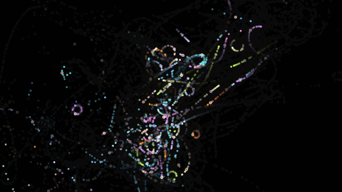

# orbital-playback

Simple node canvas rendering of aircraft tracks.



Takes a CSV file of timestamped lat/lon coordinates and outputs rendered frames.

The input CSV should look something like this:

```
2015-03-03 13:09:58-08,34.19756,-118.32881
2015-03-03 13:12:11-08,34.19756,-118.32881
2015-03-03 13:12:12-08,34.17824,-118.2931
```

The program will partition the positions into "sessions" or tracks, by
looking for gaps of >= 300 seconds between position reports. Each
track will then be animated simultaneously.

Time compression is in effect: each frame represents 1 second, so 30
fps = 30x speedup over realtime.

Position will be interpolated if a position report is missing.


Usage:

```
$ node index.js --help
Usage: index.js [options] <input CSV>

Options:
  --help              Show help                                        [boolean]
  --session-timeout   Max seconds between pings                   [default: 300]
  --output-path       Directory for output frames            [default: "frames"]
  --num-secs          Number of seconds of flights to render     [default: 5000]
  --strobe-period     Seconds between strobes                      [default: 20]
  --lat               Center latitude                 [default: 34.156149756733]
  --lon               Center longitude              [default: -118.222884689317]
  --meters-per-pixel  Map scale                    [default: 10.416666666666666]
  --width             Frame width in pixels                      [default: 1920]
  --height            Frame height in pixels                     [default: 1080]
  ```

Once frames have been rendered, you can use `ffmpeg` to make a video:

```
$ ffmpeg -i frames/%5d.png -c:v libx264 -r 30 -pix_fmt yuv420p N520PD.mp4
```

Or `mogrify` and `gifsicle` to make an animated gif:

```
$ echo frames/*.png | time xargs -t -n 1 -P 6 -I {} sh -c "mogrify -format gif -geometry 480x270 -path frames-gif/ {}"
$ gifsicle --colors 256 -d3 --loop frames-gif/*.gif > animated.gif
```
